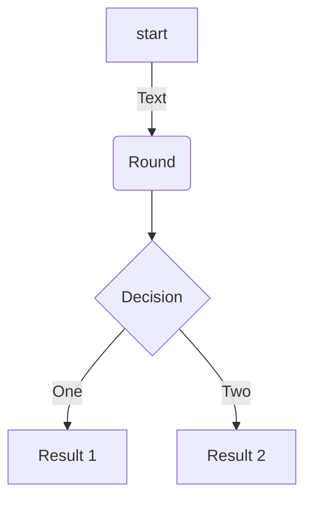
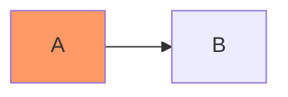
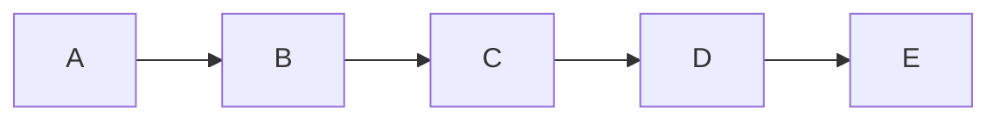

# Elemental Readme :bookmark_tabs:
"Elementary Readme" is a collection of Markdown elements that we can use to quickly create our documentation in GitHub Readmes. Feel free to reference it if you want to remember how to add basic elements to your documentation, also fee to contribute adding more common elements that we use to create documentation.

## Table of Contents (TOC)

```sh
Table of Contents
=================
* [Elemental Readme](#elemental-readme)
   * [Insert an image](#insert-an-image)
   * [Insert a GIF](#insert-a-gif)
   * [Links](#links)
   * [Insert emojis](#insert-emojis)
   * [Insert code](#insert-code)
   * [List](#list)
   * [Tables](#tables)
   * [Mermaid diagrams](#mermaid-diagrams)
   * [Checklist](#checklist)
   * [Audio](#audio)
   * [Video](#video)
   * [table of content](#table-of-content)

```
Result :arrow_down:

Table of Contents
=================

* [Elemental Readme](#elemental-readme)
   * [Insert an image](#insert-an-image)
   * [Insert a GIF](#insert-a-gif)
   * [Links](#links)
   * [Insert emojis](#insert-emojis)
   * [Insert code](#insert-code)
   * [List](#list)
   * [Tables](#tables)
   * [Mermaid diagrams](#mermaid-diagrams)
   * [Checklist](#checklist)
   * [Audio](#audio)
   * [Video](#video)
   * [table of content](#table-of-content)

:books: For long files, you can autogenerate the table of contents TOC, see more [Generate TOC 'Table Of Content'](https://github.com/ekalinin/github-markdown-toc)


## Badgets

```sh


```
Result :arrow_down:


:books: Create your own url badget in [shields.io](https://shields.io/)

## Quotes

```sh
> “It is only when we take chances, when our lives improve. The initial and the most difficult risk that we need to take is to become honest. —Walter Anderson
```
Result :arrow_down:

> “It is only when we take chances, when our lives improve. The initial and the most difficult risk that we need to take is to become honest. —Walter Anderson


## Bold, Italics and Underline

```sh
This is **bold text**, this is *italic text*, we can also cross out a ~~word~~ or phrase amd this text is ***bold an italic***
```
This is **bold text**, this is *italic text*, we can also cross out a ~~word~~ or phrase amd this text is ***bold an italic***

## Insert an Image

```html
  <p align="center">
    
  </p>
```
Result :arrow_down:

<p align="center">
  
</p>

## Insert a GIF
This is the same as image:

 
 ```html
  <p align="center">
    
  </p>
 ```

Result :arrow_down:
<p align="center">
  
</p>

## Mermaid diagrams

```sh
# FlowChart
    ```mermaid
    flowchart TD
    A[start]-->|Text| B(Round)
    B-->C{Decision}
    C-->|One| D[Result 1]
    C-->|Two| E[Result 2]
    ```
```
Result :arrow_down:



```sh
# Flow Vhart
    ```mermaid
    flowchart LR
        A:::someclass --> B
        classDef someclass fill:#f96;
    ```
```

Result :arrow_down:



```sh
# Flow Chart with references
    ```mermaid
    flowchart LR
        A-->B
        B-->C
        C-->D
        D-->E
        click A "http://www.github.com" _blank
        click B "http://www.github.com" "Open this in a new tab" _blank
        click C href "http://www.github.com" _blank
        click D href "http://www.github.com" "Open this in a new tab" _blank
    ```
```

Result :arrow_down:



:books: More about [Mermaid diagrams](https://mermaid-js.github.io/mermaid/#/)

## References

```sh
# To external resources
[Complete list of github markdown emoji markup](https://gist.github.com/rxaviers/7360908)
```
Result :arrow_down:

[Complete list of github markdown emoji markup](https://gist.github.com/rxaviers/7360908)

```sh
# To same Readme page
[Go to another topic in the same Readme](#badgets)
```
Result :arrow_down:

[Go to another topic in the same Readme](#badgets)

```sh
# To another Readme on this directory
[Go to another Readme in this workspace](other/Readme.md)
```
Result :arrow_down:

[Go to another Readme in this workspace](other/Readme.md)


## Insert emojis

```bash
:blush: :sweat_drops: :innocent: :turtle: :paw_prints: :tulip: :santa: :bulb: :postal_horn: :dart: :grapes:
```
Result :arrow_down:

:blush: :sweat_drops: :innocent: :turtle: :paw_prints: :tulip: :santa: :bulb: :postal_horn: :dart: :grapes:

:books: You can copy and paste emojis from this: [Complete list of github markdown emoji markup](https://gist.github.com/rxaviers/7360908)

## Insert code

```sh
    # Bash  
    ```bash
    echo "Hello World!"
    ``` 
```

```sh
    # Python
    ```python
    print("Hello, World!")
    ```
```

```sh
    # Html
    ```html   
    
    ```
```
Result :arrow_down:

```sh
echo "Hello World!"
```   

```python
print("Hello, World!")
```

```html   

```

## Lists

```sh
- One
- Two
- Three
  - Three one
    - Other
```
Result :arrow_down:

- One
- Two
- Three
  - Three one
    - Three one one
    - Three one two

```sh
1. One
2. Two
3. Three
```
Result :arrow_down:

1. One
2. Two
3. Three


## Tables

**Table 01**

```sh
| Value   | Description |
|---------|-------------|
| 1       | Meli        |
| 2       | Aline       |
| 3       | Elian       |
```

Result :arrow_down:

| Value   | Description |
|---------|-------------|
| 1       | Meli        |
| 2       | Aline       |
| 3       | Elian       |

**Table 02**

```sh
| Code   | Person            | Fruits     | Plants      |
|--------|-------------------|------------|-------------|
| 1      | :raising_hand:    | :grapes:   |  :mushroom: |
| 2      | :older_woman:     | :tomato:   |  :tulip:    |
| 3      | :man_with_turban: | :eggplant: |  :seedling: |
```
Result :arrow_down:

| Code   | Person            | Fruits     | Plants      |
|--------|-------------------|------------|-------------|
| 1      | :raising_hand:    | :grapes:   |  :mushroom: |
| 2      | :older_woman:     | :tomato:   |  :tulip:    |
| 3      | :man_with_turban: | :eggplant: |  :seedling: |


## Checklist

```sh
[x] **Fruits** :grapes:
  - :heavy_check_mark: Apples
  - :heavy_check_mark: Oranges

[X] **Animals**  :turtle:
  - :heavy_check_mark: Dog
  - :heavy_check_mark: Cat

[ ] **Objets**  ::guitar::
```

Result :arrow_down:

- [x] **Fruits** :grapes:
  - :heavy_check_mark: Apples
  - :heavy_check_mark: Oranges
- [X] **Animals**  :turtle:
  - :heavy_check_mark: Dog
  - :heavy_check_mark: Cat
- [ ] **Objets**  ::guitar::
 

## Keyboard input

```sh
<kbd>ALT + F4</kbd> 
<kbd>CTRL + C</kbd> 
<kbd>CTRL + V</kbd> 
```

Result :arrow_down:

<kbd>ALT + F4</kbd> 
<kbd>CTRL + C</kbd> 
<kbd>CTRL + V</kbd> 

## Video

### Simple

```html
[](https://youtu.be/fKopy74weus)
```
Result :arrow_down:

[](https://youtu.be/fKopy74weus)

### Customized

```html
<div align="left">
      <a href="https://youtu.be/fKopy74weus">
        
      </a>
</div>
```
Result :arrow_down:

<div align="left">
      <a href="https://youtu.be/fKopy74weus">
        
      </a>
</div>


## Footnote

```sh
  Here is a simple footnote[^1].

  [^1]: My reference.
```
Result :arrow_down:

Here is a simple footnote[^1].

  [^1]: My reference.