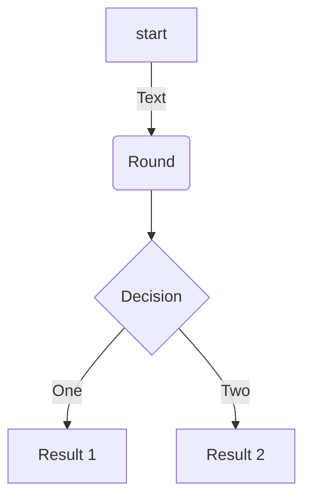
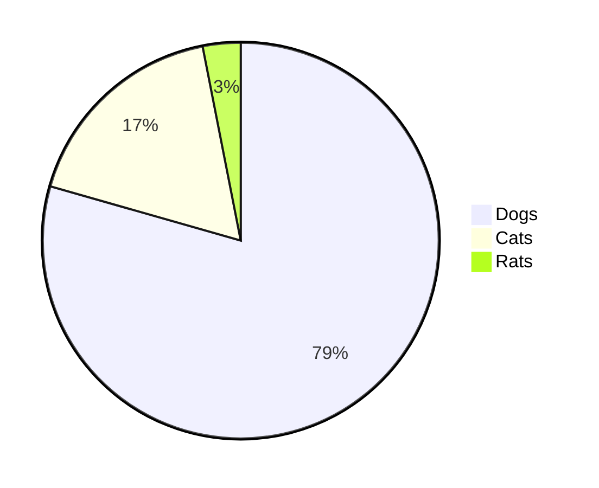

# Awesome Readme
Summary of what you can add on your redame pages to make it more attractive


## Insert an image

```html
  <p align="center">
    
  </p>
```
 
<p align="center">
  
</p>

## Insert a GIF
This is the same as image:

 
 ```html
  <p align="center">
    
  </p>
 ```
<p align="center">
  
</p>

## Links and Urls
```bash
[Complete list of github markdown emoji markup](https://gist.github.com/rxaviers/7360908)
```
Example:

[Complete list of github markdown emoji markup](https://gist.github.com/rxaviers/7360908)

## Insert Emojis
You can copy and paste from this list: [Complete list of github markdown emoji markup](https://gist.github.com/rxaviers/7360908)
```bash
:blush: :sweat_drops: :innocent: :turtle: :paw_prints: :tulip: :santa: :bulb: :postal_horn: :dart: :grapes:
```
Result:
:blush: :sweat_drops: :innocent: :turtle: :paw_prints: :tulip: :santa: :bulb: :postal_horn: :dart: :grapes:

## Insert code

```bash
#bash  
    ```bash
    echo "Hello World!"
    ``` 
```
```bash 
# Python
    ```python
     print("Hello, World!")
    ```
```
```bash
# Html
    ```html   
        
    ```
```
Result:

```bash
echo "Hello World!"
```   
```python
print("Hello, World!")
```
```html   

```


## List
```bash
- One
- Two
- Three
  - Three one
  - Three two
```
Result
- One
- Two
- Three
  - Three one
  - Three two


## Tables

```bash
| Value    | Description |
|--------- |-------------|
| 1        | Meli        |
| 2        | Aline       |
| 3        | Elian       |
```

Result:

| Value    | Description |
|--------- |-------------|
| 1        | Meli        |
| 2        | Aline       |
| 3        | Elian       |

## Mermaid diagrams

```bash
# FlowChart
    ```mermaid
    flowchart TD
    A[start]-->|Text| B(Round)
    B-->C{Decision}
    C-->|One| D[Result 1]
    C-->|Two| E[Result 2]
    ```
```



```bash
# Pie Chart
    ```mermaid
    pie
    "Dogs":386
    "Cats":85
    "Rats":15
    ```
```



```bash
#Graph chart
    ```mermaid
    graph TD
    A-->B
    A-->C
    B-->D
    C-->D
    ```
```


## Checlists
- [x] **Fruits**  :blush:
    - :heavy_check_mark: Apples
    - :heavy_check_mark: Oranges
- [x] **Animals**  :blush:
    - :heavy_check_mark: Dog
    - :heavy_check_mark: Cat

## Audio


## Videos

[](https://youtu.be/fKopy74weus)
