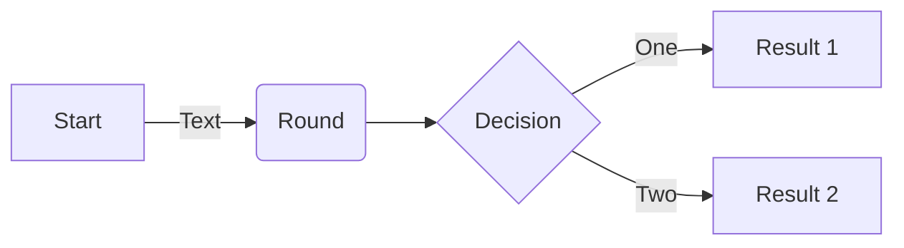
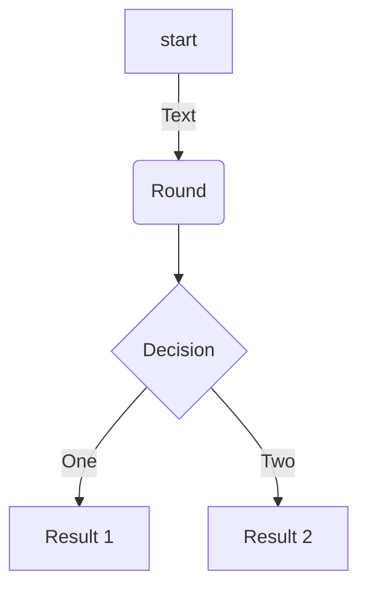
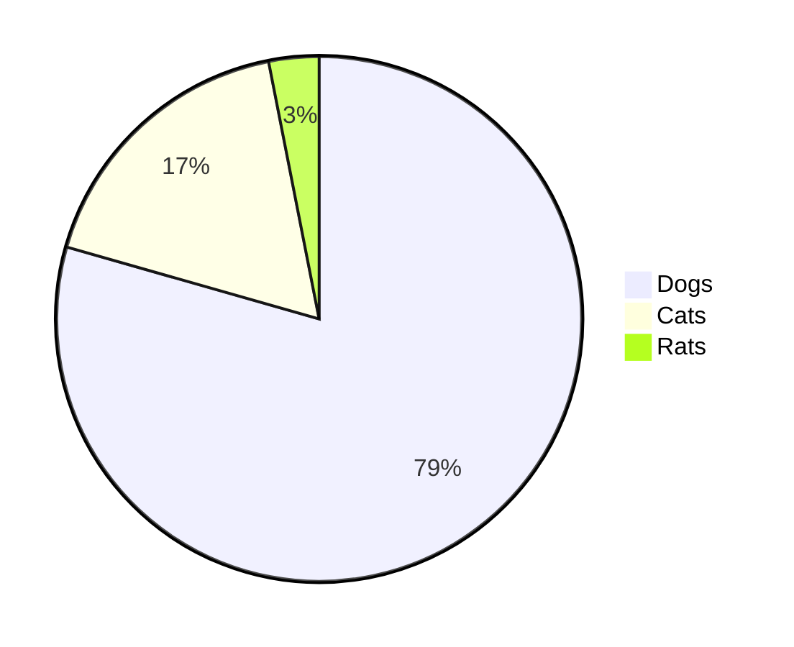

# Awesome Readme
Summary of what you can add on your redame pages to make it more attractive


## Insert Image

```html
<p align="center">
  
</p>
```

Example: 
<p align="center">
  
</p>


## Links and Urls
```bash
[GitHub Emoticones](https://gist.github.com/rxaviers/7360908)
```
Example:

[Complete list of github markdown emoji markup](https://gist.github.com/rxaviers/7360908)

## Emoticones
You can copy paste from the here: [Complete list of github markdown emoji markup](https://gist.github.com/rxaviers/7360908)
```bash
:blush: :sweat_drops: :innocent: :turtle:
```
Result:
:blush: :sweat_drops: :innocent: :turtle:

## Code

```bash
#bash  
    ```bash
    echo "Hello World!"
    ``` 
```
```bash 
# Python
    ```python
     print("Hello, World!")
    ```
```
```bash
# Html
    ```html   
        
    ```
```
Result:

```bash
echo "Hello World!"
```   
```python
print("Hello, World!")
```
```html   

```


## List
```bash
- One
- Two
- Three
  - Three one
  - Three two
```
Result
- One
- Two
- Three
  - Three one
  - Three two


## Tables

```bash
| Value    | Description |
|--------- |-------------|
| 1        | Meli        |
| 2        | Aline       |
| 3        | Elian       |
```

Result:

| Value    | Description |
|--------- |-------------|
| 1        | Meli        |
| 2        | Aline       |
| 3        | Elian       |

## Mermaid diagrams








