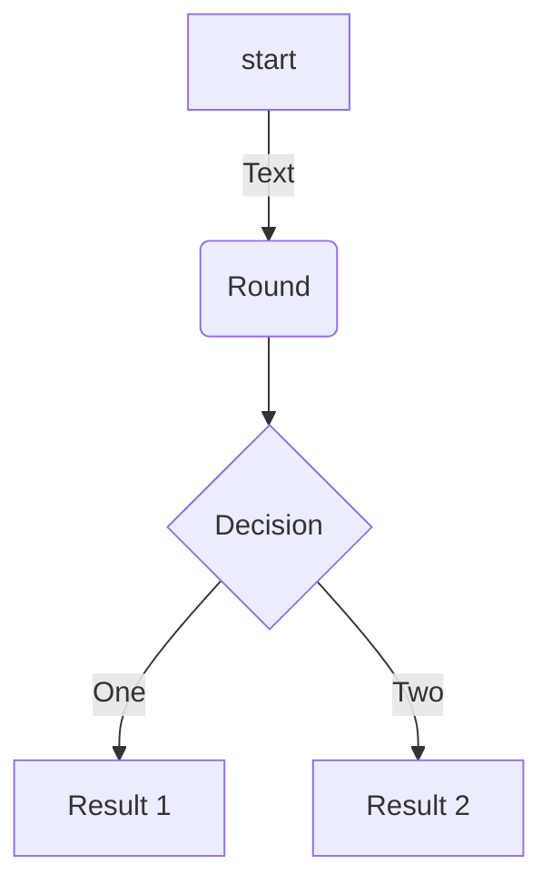
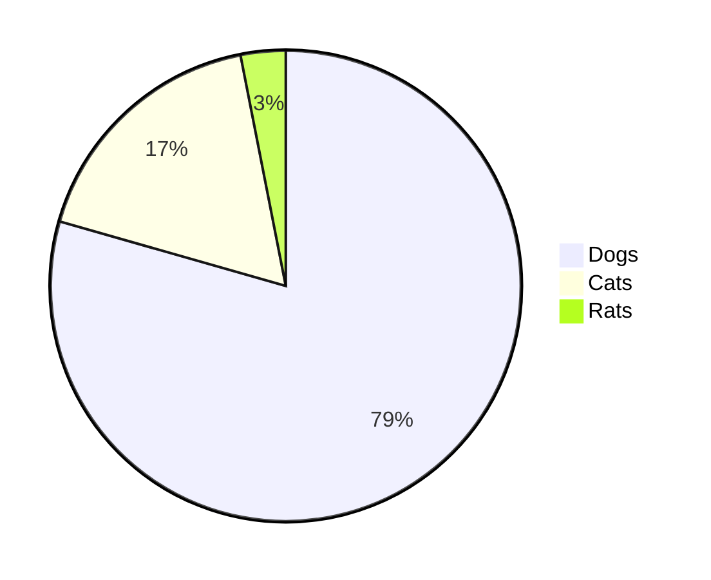

# Elemental Readme
Summary of what you can add on your redame pages to make it more attractive

## Table of Contents (TOC)

```bash
Table of Contents
=================
* [Elemental Readme](#elemental-readme)
   * [Insert an image](#insert-an-image)
   * [Insert a GIF](#insert-a-gif)
   * [Links](#links)
   * [Insert emojis](#insert-emojis)
   * [Insert code](#insert-code)
   * [List](#list)
   * [Tables](#tables)
   * [Mermaid diagrams](#mermaid-diagrams)
   * [Checklist](#checklist)
   * [Audio](#audio)
   * [Video](#video)
   * [table of content](#table-of-content)

```

Table of Contents
=================

* [Elemental Readme](#elemental-readme)
   * [Insert an image](#insert-an-image)
   * [Insert a GIF](#insert-a-gif)
   * [Links](#links)
   * [Insert emojis](#insert-emojis)
   * [Insert code](#insert-code)
   * [List](#list)
   * [Tables](#tables)
   * [Mermaid diagrams](#mermaid-diagrams)
   * [Checklist](#checklist)
   * [Audio](#audio)
   * [Video](#video)
   * [table of content](#table-of-content)

For long files you can autogenerate table of contents, see more [Generate TOC 'Table Of Content'](https://github.com/ekalinin/github-markdown-toc)


## Quotes

> “It is only when we take chances, when our lives improve. The initial and the most difficult risk that we need to take is to become honest. —Walter Anderson


## Bold, Italics and Underline

This is ***bold text**, this is *italic text*, we can also cross out a ~~word~~ or phrase amd this text is ***bold an italic***

## Insert an Image

```html
  <p align="center">
    
  </p>
```
 
<p align="center">
  
</p>

## Insert a GIF
This is the same as image:

 
 ```html
  <p align="center">
    
  </p>
 ```
<p align="center">
  
</p>

## Links
```bash
[Complete list of github markdown emoji markup](https://gist.github.com/rxaviers/7360908)
```
Result:

[Complete list of github markdown emoji markup](https://gist.github.com/rxaviers/7360908)

## Insert emojis
You can copy and paste from this list: [Complete list of github markdown emoji markup](https://gist.github.com/rxaviers/7360908)
```bash
:blush: :sweat_drops: :innocent: :turtle: :paw_prints: :tulip: :santa: :bulb: :postal_horn: :dart: :grapes:
```
Result:
:blush: :sweat_drops: :innocent: :turtle: :paw_prints: :tulip: :santa: :bulb: :postal_horn: :dart: :grapes:

## Insert code

```bash
  #bash  
  ```bash
  echo "Hello World!"
  ``` 
```
```bash 
  # Python
  ```python
    print("Hello, World!")
  ```
```
```bash
  # Html
  ```html   
    
  ```
```
Result:

```bash
echo "Hello World!"
```   
```python
print("Hello, World!")
```
```html   

```

##  Links
[Contribution guidelines for this project](docs/CONTRIBUTING.md)


## List
```bash
- One
- Two
- Three
  - Three one
  - Three two
```
Result:
- One
- Two
- Three
  - Three one
  - Three two

1. One
2. Two
3. Three


## Tables

```bash
| Value    | Description |
|--------- |-------------|
| 1        | Meli        |
| 2        | Aline       |
| 3        | Elian       |
```

Result:

| Value    | Description |
|--------- |-------------|
| 1        | Meli        |
| 2        | Aline       |
| 3        | Elian       |

## Mermaid diagrams

```bash
# FlowChart
    ```mermaid
    flowchart TD
    A[start]-->|Text| B(Round)
    B-->C{Decision}
    C-->|One| D[Result 1]
    C-->|Two| E[Result 2]
    ```
```
Result:



```bash
# Pie Chart
    ```mermaid
    pie
    "Dogs":386
    "Cats":85
    "Rats":15
    ```
```



Result:

```bash
#Graph chart
    ```mermaid
    graph TD
    A-->B
    A-->C
    B-->D
    C-->D
    ```
```
Result:


## Checklist

```bash
- [x] **Fruits** :grapes:
    - :heavy_check_mark: Apples
    - :heavy_check_mark: Oranges
- [] **Animals**  :turtle:
    - :heavy_check_mark: Dog
    - :heavy_check_mark: Cat
```
- [x] **Fruits** :grapes:
    - :heavy_check_mark: Apples
    - :heavy_check_mark: Oranges
- [] **Animals**  :turtle:
    - :heavy_check_mark: Dog
    - :heavy_check_mark: Cat

## Audio

<audio src="ThatOneBarScene-RKVC.mp3" controls preload></audio>

## Video

[](https://youtu.be/fKopy74weus)

[](https://youtu.be/fKopy74weus)


## Footnote

Here is a simple footnote[^1].


[^1]: My reference.