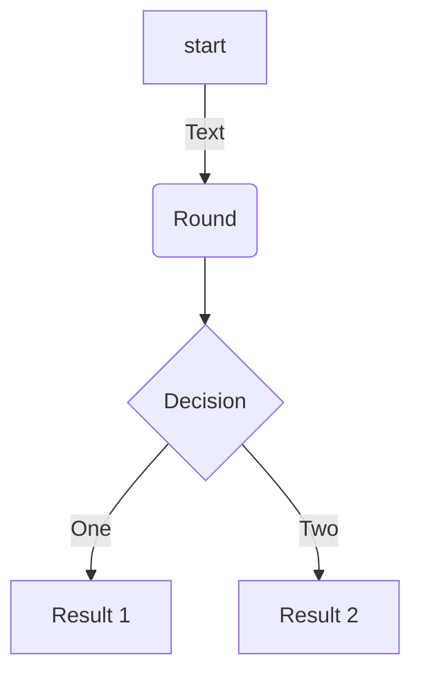
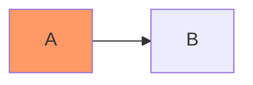

# Elemental Readme
Summary of what you can add on your redame pages to make it more attractive

## Table of Contents (TOC)

```sh
Table of Contents
=================
* [Elemental Readme](#elemental-readme)
   * [Insert an image](#insert-an-image)
   * [Insert a GIF](#insert-a-gif)
   * [Links](#links)
   * [Insert emojis](#insert-emojis)
   * [Insert code](#insert-code)
   * [List](#list)
   * [Tables](#tables)
   * [Mermaid diagrams](#mermaid-diagrams)
   * [Checklist](#checklist)
   * [Audio](#audio)
   * [Video](#video)
   * [table of content](#table-of-content)

```

Table of Contents
=================

* [Elemental Readme](#elemental-readme)
   * [Insert an image](#insert-an-image)
   * [Insert a GIF](#insert-a-gif)
   * [Links](#links)
   * [Insert emojis](#insert-emojis)
   * [Insert code](#insert-code)
   * [List](#list)
   * [Tables](#tables)
   * [Mermaid diagrams](#mermaid-diagrams)
   * [Checklist](#checklist)
   * [Audio](#audio)
   * [Video](#video)
   * [table of content](#table-of-content)

For long files you can autogenerate table of contents, see more [Generate TOC 'Table Of Content'](https://github.com/ekalinin/github-markdown-toc)


## Badgets

```sh


```


Create your own url badget: https://shields.io/

## Quotes

> “It is only when we take chances, when our lives improve. The initial and the most difficult risk that we need to take is to become honest. —Walter Anderson


## Bold, Italics and Underline

This is ***bold text**, this is *italic text*, we can also cross out a ~~word~~ or phrase amd this text is ***bold an italic***

## Insert an Image

```html
  <p align="center">
    
  </p>
```
 
<p align="center">
  
</p>

## Insert a GIF
This is the same as image:

 
 ```html
  <p align="center">
    
  </p>
 ```
<p align="center">
  
</p>


## References

```sh
# To external resources
[Complete list of github markdown emoji markup](https://gist.github.com/rxaviers/7360908)
```
  [Complete list of github markdown emoji markup](https://gist.github.com/rxaviers/7360908)

```sh
# To same Readme page
[Go to another topic in the same Readme](#badgets)
```
  [Go to another topic in the same Readme](#badgets)

```sh
# To another Readme on this directory
[Go to another Readme in this workspace](other/Readme.md)
```
  [Go to another Readme in this workspace](other/Readme.md)


## Insert emojis
You can copy and paste from this list: [Complete list of github markdown emoji markup](https://gist.github.com/rxaviers/7360908)
```bash
:blush: :sweat_drops: :innocent: :turtle: :paw_prints: :tulip: :santa: :bulb: :postal_horn: :dart: :grapes:
```
Result:
:blush: :sweat_drops: :innocent: :turtle: :paw_prints: :tulip: :santa: :bulb: :postal_horn: :dart: :grapes:

## Insert code

```sh
    # Bash  
    ```bash
    echo "Hello World!"
    ``` 
```

```sh
    # Python
    ```python
    print("Hello, World!")
    ```
```

```sh
    # Html
    ```html   
    
    ```
```
Result:

```sh
echo "Hello World!"
```   
```python
print("Hello, World!")
```
```html   

```


## List
```bash
- One
- Two
- Three
  - Three one
    - Other
  - Three two
```
Result:
- One
- Two
- Three
  - Three one
    - Other
  - Three two

1. One
2. Two
3. Three


## Tables

```sh
| Value    | Description |
|--------- |-------------|
| 1        | Meli        |
| 2        | Aline       |
| 3        | Elian       |
```

Result:

| Value    | Description |
|--------- |-------------|
| 1        | Meli        |
| 2        | Aline       |
| 3        | Elian       |

## Mermaid diagrams

```sh
# FlowChart
    ```mermaid
    flowchart TD
    A[start]-->|Text| B(Round)
    B-->C{Decision}
    C-->|One| D[Result 1]
    C-->|Two| E[Result 2]
    ```
```



```sh
# Flow Vhart
    ```mermaid
    flowchart LR
        A:::someclass --> B
        classDef someclass fill:#f96;
    ```
```



```sh
# Flow Chart with references
    ```mermaid
    flowchart LR
        A-->B
        B-->C
        C-->D
        D-->E
        click A "http://www.github.com" _blank
        click B "http://www.github.com" "Open this in a new tab" _blank
        click C href "http://www.github.com" _blank
        click D href "http://www.github.com" "Open this in a new tab" _blank
    ```
```

```mermaid
flowchart LR
    A-->B
    B-->C
    C-->D
    D-->E
    click A "http://www.github.com" _blank
    click B "http://www.github.com" "Open this in a new tab" _blank fill:#f96
    click C href "http://www.github.com" _blank
    click D href "http://www.github.com" "Open this in a new tab" _blank fill:#f96
```
[More about Mermaid](https://mermaid-js.github.io/mermaid/#/)
## Checklist

```sh
- [x] **Fruits** :grapes:
    - :heavy_check_mark: Apples
    - :heavy_check_mark: Oranges
- [] **Animals**  :turtle:
    - :heavy_check_mark: Dog
    - :heavy_check_mark: Cat
```
- [x] **Fruits** :grapes:
    - :heavy_check_mark: Apples
    - :heavy_check_mark: Oranges
- [] **Animals**  :turtle:
    - :heavy_check_mark: Dog
    - :heavy_check_mark: Cat

## Video

### Simple
[](https://youtu.be/fKopy74weus)

### Customized
<div align="left">
      <a href="https://youtu.be/fKopy74weus">
        
      </a>
</div>


## Keyboard input

<kbd>ALT + F4</kbd> 
<kbd>CTRL + C</kbd> 
<kbd>CTRL + V</kbd> 

## Footnote

Here is a simple footnote[^1].


[^1]: My reference.